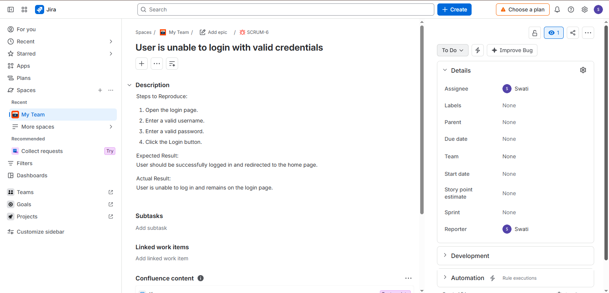

# E-Commerce Website Testing

## Project Overview

This is a practice manual testing project created to demonstrate practical software testing skills.

The project focuses on testing the major modules of an e-commerce website.

## Modules Tested

- Registration
- Login
- Cart
- Checkout

## Testing Activities

- Test Scenario Creation
- Test Case Design
- Positive & Negative Testing
- Functional Testing
- Test Case Execution
- Bug Reporting
- Regression Testing

## Test Documentation

The Excel file contains:

- Test Scenarios
- Test Cases
- Test Data
- Expected Results
- Actual Results
- Test Status
- Bug Reporting

## Tools Used

- Microsoft Excel
- Jira – Bug Reporting Practice

## Project Type

**Practice / Portfolio Project**

This project was created for learning and demonstrating manual testing skills. No production/live website was used.

## Project Deliverable

[View E-Commerce Testing Excel File](./My_Project.xlsx)

## Jira Bug Report

A bug was reported in Jira for the login module.

**Bug:** User is unable to login with valid credentials  
**Issue Key:** SCRUM-6  
**Priority:** High

### Bug Documentation

## API Testing with Postman

API testing was performed using Postman to validate REST API requests and responses.

### API Tests Performed

* GET request – User data retrieval
* POST request – Create new data
* Status code validation
* Response data validation
* JSON request/response validation
* Automated test assertions using Postman scripts

### API Test Results

* GET API: **200 OK** ✅
* POST API: **201 Created** ✅
* Response fields validated using Postman tests

### Postman Collection

[Download Postman API Testing Collection](./E-Commerce%20API%20Testing.postman_collection.json)

